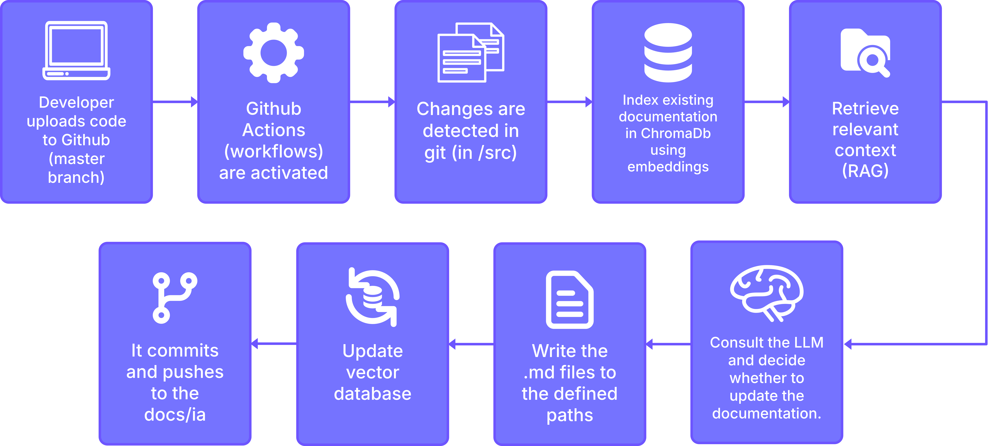
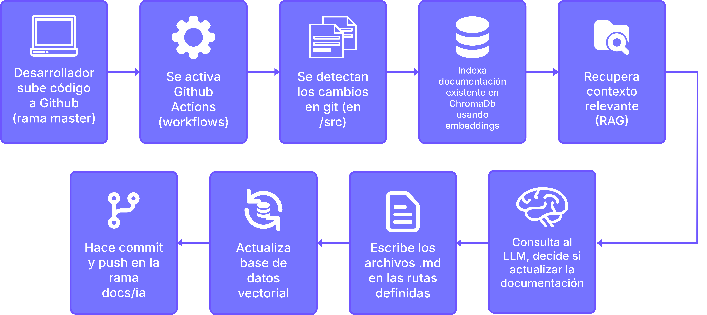

# Automatic Documentation with AI + RAG

Pipeline that uses AI to generate, update, and maintain technical documentation continuously, integrated into a CI/CD flow.

---

## Index

- [English](#english)
  - [How it works](#how-it-works)
  - [RAG System](#rag-system)
  - [Documentation Schema (schema.yml)](#documentation-schema-schemayml)
  - [Configuration](#configuration)
  - [Output: static site with Docusaurus](#output-static-site-with-docusaurus)
  - [Tech Stack](#tech-stack)
  - [Project Structure](#project-structure)
  - [Adapt the pipeline to your project](#adapt-the-pipeline-to-your-project)
- [Español](#español)
  - [Cómo funciona](#cómo-funciona)
  - [Sistema RAG](#sistema-rag)
  - [Esquema de documentación (schema.yml)](#esquema-de-documentación-schemayml)
  - [Configuración](#configuración)
  - [Salida: sitio estático con Docusaurus](#salida-sitio-estático-con-docusaurus)
  - [Stack tecnológico](#stack-tecnológico)
  - [Estructura del proyecto](#estructura-del-proyecto)
  - [Adaptar el pipeline a tu proyecto](#adaptar-el-pipeline-a-tu-proyecto)

---

## English

### How it works



Whenever changes are detected in the source code (`src/`) on the `master` branch, a GitHub Actions workflow executes the pipeline:

1. **Change detection** — The git diff of modified files is extracted.
2. **RAG query** — An existing documentation semantic index (ChromaDB + LlamaIndex) is searched for relevant context related to the detected changes.
3. **LLM decision** — The diff and retrieved context are sent to a language model (DeepSeek) that first evaluates whether the changes are relevant enough to warrant documentation updates. If relevant, it decides which files to create, update, or delete; otherwise it returns an empty action set and the pipeline stops.
4. **Execution** — The decided actions are applied to the Markdown files in `docs/`.
5. **Publishing** — Changes are committed to the `docs/ia` branch and automatically reflected in the static site generated with Docusaurus.

### RAG System

The pipeline's core is a Retrieval-Augmented Generation (RAG) system that indexes all existing documentation in a vector store. Before generating new documentation, it queries this index to:

- Contrast already-written documentation against current changes.
- Avoid duplicates and redundancies.
- Maintain tonal, structural, and terminological consistency with previous documents.
- Provide relevant context to the LLM so decisions are informed.

### Documentation Schema (`schema.yml`)

The `docs/schema.yml` file defines the style, structure, and documentation rules for the project. It specifies:

- Target audiences (developers and end users).
- Required sections (tutorials, guides, reference, explanations).
- Decision rules on when and how to document based on the type of change.
- Frontmatter and content templates for each page type.
- Naming, navigation, and linking conventions.

It does not enforce a rigid format: it is designed for the AI to interpret it optimally and generate documentation consistent with the defined rules.

### Configuration

The pipeline behavior is tuned through central constants in `src/config.py`:

| Parameter                     | Value     | Description                                         |
|-------------------------------|-----------|-----------------------------------------------------|
| `LLM_MODEL`                   | deepseek-v4-flash | Model used for documentation decisions     |
| `LLM_TEMPERATURE`             | 0.1       | Low temperature keeps output deterministic          |
| `LLM_MAX_TOKENS`              | 10 000    | Maximum tokens per LLM response                     |
| `EMBED_MODEL`                 | all-MiniLM-L6-v2 | Model for semantic indexing                 |
| `CHUNK_SIZE`                  | 300       | Characters per text chunk for RAG indexing          |
| `CHUNK_OVERLAP`               | 30        | Overlap between consecutive chunks                  |
| `RAG_TOP_K`                   | 3         | Number of relevant chunks retrieved per query       |
| `RAG_SCORE_THRESHOLD`         | 0.15      | Minimum similarity score to consider a chunk        |
| `DIFF_MAX_LINES_PER_FILE`     | 280       | Max diff lines sent to the LLM per file             |
| `DOC_EXISTING_SIMILARITY_THRESHOLD` | 0.72 | Threshold for considering two docs duplicates |

### Output: static site with Docusaurus

The generated documentation is published as a static website built with **Docusaurus**, with full support for sidebar navigation, search, and audience-based organization. Docusaurus is just one possible output — the pipeline generates plain Markdown files in `docs/`, so you can adapt it to any static site generator (MkDocs, Jekyll, VitePress, etc.) or documentation platform.

### Tech Stack

| Component         | Technology                          |
|-------------------|-------------------------------------|
| Pipeline          | Python                              |
| CI Orchestration  | GitHub Actions                      |
| Vector store (RAG)| ChromaDB                            |
| Semantic indexing | LlamaIndex + sentence-transformers  |
| LLM               | DeepSeek (API)                      |
| Docs site         | Docusaurus                          |
| Schema            | YAML (`schema.yml`)                 |

### Project Structure

```
.
├── .github/workflows/   # CI/CD workflow (docs-pipeline.yml)
├── docs/                # Generated documentation
│   ├── dev/             #   Developer documentation
│   ├── user/            #   End-user documentation
│   └── schema.yml       #   Style and rules schema
├── src/                 # Pipeline source code
│   ├── __main__.py      #   Entry point
│   ├── _logging.py      #   Logging configuration
│   ├── config/          #   Centralized configuration
│   │   ├── models.py    #     Pydantic models
│   │   └── settings.py  #     Settings loading
│   ├── docs/            #   Documentation file operations
│   │   ├── inventory.py #     File discovery
│   │   ├── schema.py    #     Schema loading
│   │   └── sync.py      #     Index synchronization
│   ├── git/             #   Git change extraction
│   │   └── diff.py      #     Diff parsing
│   ├── llm/             #   LLM interaction
│   │   ├── client.py    #     API call + JSON cleaning
│   │   └── prompt.py    #     Prompt building
│   ├── pipeline/        #   Orchestration
│   │   ├── executor.py  #     Action execution
│   │   └── orchestrator.py #  Main orchestrator
│   └── rag/             #   RAG indexing & querying
│       ├── chunker.py   #     Text chunking
│       ├── indexer.py   #     Vector store indexing
│       ├── retriever.py #     Similarity search
│       └── setup.py     #     Embedding model init
├── vector_store/        # Persistent semantic index (ChromaDB)
├── website/             # Docusaurus site
└── requirements.txt
```

### Adapt the pipeline to your project

You can integrate this pipeline into any code repository by following these steps:

1. **Copy the `src/`, `vector_store/`, and `website/` directories** to the root of your project.
2. **Copy the workflow** `.github/workflows/docs-pipeline.yml` to your repository.
3. **Configure the required environment variables** in your repository Secrets (GitHub Actions → Secrets):
   - `DEEPSEEK_API_KEY` — Your DeepSeek API key.
4. **Customize `docs/schema.yml`** with your project's documentation rules.
5. **Adjust `src/config.py`** to point to the correct paths for your source code and documentation directory.

Once done, the pipeline will run automatically on every push to `master` that modifies files in `src/`, generating and updating documentation without manual intervention.

---

### Changelog

#### 2026-05-24

- **`src/llm/client.py`** — Added `_clean_json_text()` that strips invalid JSON escapes from LLM output (markdown escapes like `\_`, `\-`, `\#`, `` \` ``, and line continuations `\<newline>`). Prevents `Invalid \escape` errors from `json.loads` when the LLM escapes markdown characters inside JSON string values.
- **`src/pipeline/executor.py`** — Added path normalization with `os.path.normpath()` so the `startswith("docs/")` security check works correctly on Windows.
- **`src/docs/sync.py`** — Moved `logging.basicConfig()` before `logger` creation so the format configuration applies globally.

---

## Español

### Cómo funciona



Cada vez que se detectan cambios en el código fuente (`src/`) en la rama `master`, un workflow de GitHub Actions ejecuta el pipeline:

1. **Detección de cambios** — Se extrae el diff de git de los archivos modificados.
2. **Consulta RAG** — Se busca en un índice semántico (ChromaDB + LlamaIndex) la documentación existente relacionada con los cambios detectados, recuperando contexto relevante de docs anteriores.
3. **Decisión con LLM** — El diff y el contexto recuperado se envían a un modelo de lenguaje (DeepSeek) que primero evalúa si los cambios son lo suficientemente relevantes como para ameritar actualizar la documentación. Si lo son, decide qué archivos crear, actualizar o eliminar; en caso contrario devuelve un conjunto vacío de acciones y el pipeline se detiene.
4. **Ejecución** — Se aplican las acciones decididas sobre los archivos Markdown en `docs/`.
5. **Publicación** — Los cambios se commitean en la rama `docs/ia` y se reflejan automáticamente en el sitio estático generado con Docusaurus.

### Sistema RAG

El núcleo del pipeline es un sistema de Retrieval-Augmented Generation (RAG) que indexa toda la documentación existente en un vector store. Antes de generar nueva documentación, consulta este índice para:

- Contrastar la documentación ya escrita contra los cambios actuales.
- Evitar duplicados y redundancias.
- Mantener consistencia tonal, estructural y terminológica con documentos anteriores.
- Proporcionar contexto relevante al LLM para que las decisiones sean informadas.

### Esquema de documentación (`schema.yml`)

El archivo `docs/schema.yml` define el estilo, estructura y reglas de documentación del proyecto. En él se especifican:

- Audiencias objetivo (desarrolladores y usuarios finales).
- Secciones requeridas (tutoriales, guías, referencia, explicaciones).
- Reglas de decisión sobre cuándo y cómo documentar según el tipo de cambio.
- Plantillas de frontmatter y contenido para cada tipo de página.
- Convenciones de nombrado, navegación y enlazado.

No exige un formato rígido: está diseñado para que la IA lo interprete de forma óptima y genere documentación coherente con las reglas definidas.

### Configuración

El comportamiento del pipeline se ajusta mediante constantes centralizadas en `src/config.py`:

| Parámetro                      | Valor     | Descripción                                           |
|--------------------------------|-----------|-------------------------------------------------------|
| `LLM_MODEL`                    | deepseek-v4-flash | Modelo usado para las decisiones de documentación |
| `LLM_TEMPERATURE`              | 0.1       | Temperatura baja mantiene la salida determinista      |
| `LLM_MAX_TOKENS`               | 10 000    | Máximo de tokens por respuesta del LLM               |
| `EMBED_MODEL`                  | all-MiniLM-L6-v2 | Modelo para indexación semántica              |
| `CHUNK_SIZE`                   | 300       | Caracteres por fragmento de texto para el índice RAG |
| `CHUNK_OVERLAP`                | 30        | Superposición entre fragmentos consecutivos          |
| `RAG_TOP_K`                    | 3         | Fragmentos relevantes recuperados por consulta       |
| `RAG_SCORE_THRESHOLD`          | 0.15      | Puntuación de similitud mínima para considerar un fragmento |
| `DIFF_MAX_LINES_PER_FILE`      | 280       | Máximo de líneas de diff enviadas al LLM por archivo |
| `DOC_EXISTING_SIMILARITY_THRESHOLD` | 0.72 | Umbral para considerar dos documentos como duplicados |

### Salida: sitio estático con Docusaurus

La documentación generada se publica como un sitio web estático construido con **Docusaurus**, con soporte completo para navegación lateral, búsqueda y organización por audiencias. Docusaurus es solo un ejemplo de salida — el pipeline genera archivos Markdown planos en `docs/`, por lo que se puede adaptar a cualquier generador de sitios estáticos (MkDocs, Jekyll, VitePress, etc.) o plataforma de documentación.

### Stack tecnológico

| Componente        | Tecnología                         |
|-------------------|------------------------------------|
| Pipeline          | Python                             |
| Orquestación CI   | GitHub Actions                     |
| Vector store (RAG)| ChromaDB                           |
| Indexado semántico| LlamaIndex + sentence-transformers |
| LLM               | DeepSeek (API)                     |
| Sitio de docs     | Docusaurus                         |
| Esquema           | YAML (`schema.yml`)                |

### Estructura del proyecto

```
.
├── .github/workflows/   # Workflow CI/CD (docs-pipeline.yml)
├── docs/                # Documentación generada
│   ├── dev/             #   Documentación para desarrolladores
│   ├── user/            #   Documentación para usuarios finales
│   └── schema.yml       #   Esquema de estilo y reglas
├── src/                 # Código fuente del pipeline
│   ├── __main__.py      #   Punto de entrada
│   ├── _logging.py      #   Configuración de logging
│   ├── config/          #   Configuración centralizada
│   │   ├── models.py    #     Modelos Pydantic
│   │   └── settings.py  #     Carga de configuraciones
│   ├── docs/            #   Operaciones con archivos de documentación
│   │   ├── inventory.py #     Descubrimiento de archivos
│   │   ├── schema.py    #     Carga del schema
│   │   └── sync.py      #     Sincronización de índices
│   ├── git/             #   Extracción de cambios git
│   │   └── diff.py      #     Parseo de diffs
│   ├── llm/             #   Interacción con LLM
│   │   ├── client.py    #     Llamada API + limpieza JSON
│   │   └── prompt.py    #     Construcción de prompts
│   ├── pipeline/        #   Orquestación
│   │   ├── executor.py  #     Ejecución de acciones
│   │   └── orchestrator.py #  Orquestador principal
│   └── rag/             #   Indexado y consulta RAG
│       ├── chunker.py   #     Fragmentación de texto
│       ├── indexer.py   #     Indexado en vector store
│       ├── retriever.py #     Búsqueda por similitud
│       └── setup.py     #     Inicialización del modelo de embeddings
├── vector_store/        # Índice semántico persistente (ChromaDB)
├── website/             # Sitio Docusaurus
└── requirements.txt
```

### Adaptar el pipeline a tu proyecto

Puedes integrar este pipeline en cualquier repositorio de código siguiendo estos pasos:

1. **Copia los directorios `src/`, `vector_store/` y `website/`** a la raíz de tu proyecto.
2. **Copia el workflow** `.github/workflows/docs-pipeline.yml` a tu repositorio.
3. **Configura las variables de entorno** necesarias en los Secrets de tu repositorio (GitHub Actions → Secrets):
   - `DEEPSEEK_API_KEY` — Tu clave de API de DeepSeek.
4. **Personaliza `docs/schema.yml`** con las reglas de documentación de tu proyecto.
5. **Ajusta `src/config.py`** para que apunte a las rutas correctas de tu código fuente y directorio de documentación.

Una vez hecho esto, el pipeline se ejecutará automáticamente en cada push a `master` que modifique archivos en `src/`, generando y actualizando la documentación sin intervención manual.

---

### Changelog

#### 2026-05-24

- **`src/llm/client.py`** — Añadida `_clean_json_text()` que elimina escapes inválidos de JSON generados por el LLM (escapes de markdown como `\_`, `\-`, `\#`, `` \` ``, y continuaciones de línea `\<newline>`). Previene errores `Invalid \escape` de `json.loads` cuando el LLM escapa caracteres markdown dentro de valores string.
- **`src/pipeline/executor.py`** — Añadida normalización de rutas con `os.path.normpath()` para que la comprobación de seguridad `startswith("docs/")` funcione correctamente en Windows.
- **`src/docs/sync.py`** — Movido `logging.basicConfig()` antes de la creación del `logger` para que la configuración se aplique globalmente.
